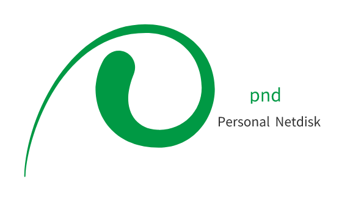



# home-dash

## 介绍

`home-dash` 是当前仓库中的后端项目目录名，对应原 `PND`（`Personal Network Disk`）单体式网络存储系统的后端工程，面向个人与家庭场景。

当前版本以“个人网盘可用版”为主线，已经具备基础文件管理、大文件分块上传、断点续传、文件下载、视频播放和系统信息统计等能力，后续将逐步演进到家庭 NAS 场景。

## 当前定位

- 后端技术主干：JDK 21 + Spring Boot 3.3.4 + MyBatis
- 架构形态：单体项目
- 适用场景：单用户、家庭主人、局域网优先
- 当前重点：功能完善、页面支撑、阶段化演进
- 第六阶段再统一处理登录、权限、安全、域名和 SSL

## 当前已实现能力

- 文件及文件夹：创建、重命名、删除、移动、复制
- 文件列表查询与基础排序
- 面包屑路径查询
- 大文件分块上传与断点续传
- 文件下载与视频播放链路
- 系统信息统计
- 统一响应结构与全局异常处理
- MD5、秒传、完整性校验等能力已具备代码基础

## 规划方向

- 阶段一：核心网盘可用版补齐与稳定化
- 阶段二：预览与检索整理
- 阶段三：媒体中心与家庭 NAS 体验
- 阶段四：数据治理与任务中心
- 阶段五：家庭设备接入与备份联动
- 阶段六：登录与安全体系

## 技术栈

- 框架：Spring Boot 3.3.4
- JDK：21
- 数据访问：MyBatis
- 数据库：H2 2.2.224 / MySQL
- 构建工具：Maven
- 容器化：Docker

## 快速开始

### Docker 部署

```bash
docker run -d -p 8989:8989 -v [YourOwnPath]:/pnd/data bitinit/pnd
```

### 源码构建

```bash
git clone git@github.com:BitInit/pnd.git
cd pnd
mvn clean package
bin/startup.sh
```

## 相关文档

- [功能规划与阶段设计](./OPTIMIZATION_SUGGESTIONS.md)
- [开发规范](./SKILLS_SPEC.md)
