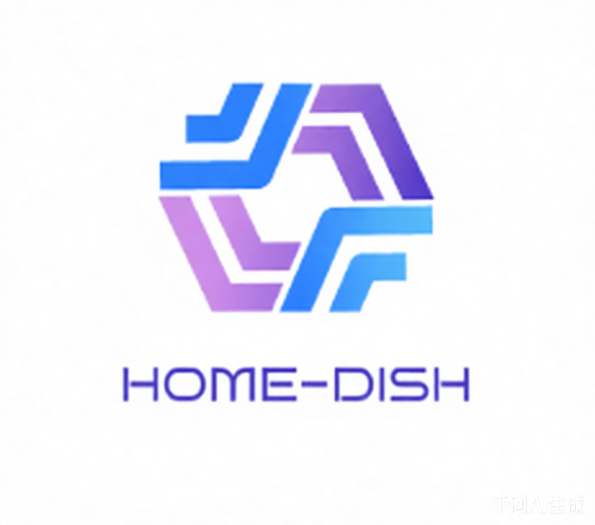

# home-dash

## 项目简介

`home-dash` 是 HomeDash 项目的后端服务，基于 Spring Boot 3 + MyBatis-Plus，提供文件管理、分块上传、下载、系统统计等能力。

## 当前状态（阶段一）

- 阶段定位：核心网盘可用版（已完全完成）
- 适用场景：单用户、家庭主人、局域网优先
- 标准能力清单：
  - 文件列表、目录切换、面包屑
  - 新建、重命名、删除、移动、复制
  - 单文件上传、分块上传、断点续传、分块合并
  - MD5 预检、秒传、完整性校验
  - 传输列表与清理
  - 系统信息统计与视频播放基础支撑
  - 统一响应与全局异常处理

## 技术栈

- JDK 21
- Spring Boot 3.3.4
- MyBatis-Plus
- H2 2.2.224（默认）/ MySQL（可选）
- Maven

## 快速开始

```bash
mvn clean package
bin/startup.sh
```
